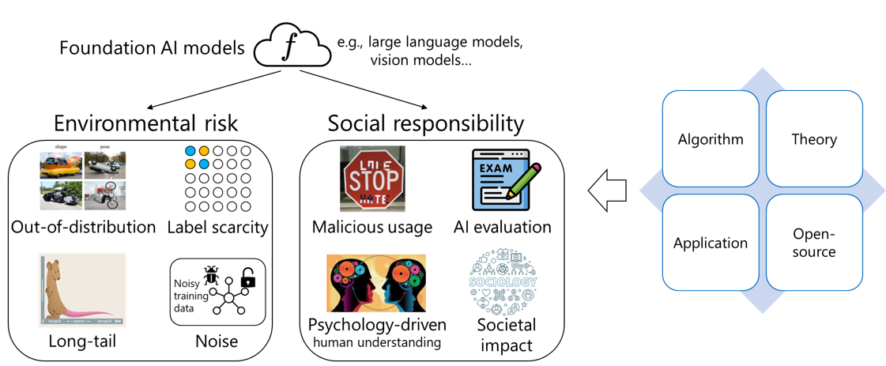
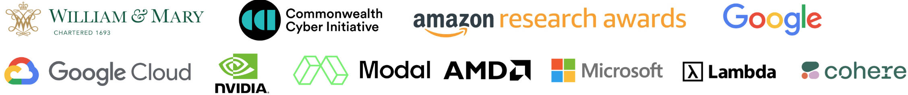

The long-term research goal is to understand and improve modern AI models (e.g., pre-trained models, large language models, and multimodal models). We create new theory, algorithms, applications, and open-sourced library to achieve our goal. The following lists some of the key research focuses and my full publications can be found at [Google Scholar](https://scholar.google.com/citations?hl=en&user=hBZ_tKsAAAAJ&view_op=list_works&sortby=pubdate). 

You are welcome to read the *annual review of my research*: [2025](https://jd92wang.notion.site/My-Research-in-2025-A-Review-2cdb4ea70d8e80248b6feec9fdc3a99b), [2024](https://jd92wang.notion.site/My-Research-in-2024-A-Review-157b4ea70d8e80cf9cabe45c72844846?source=copy_link), [2023](https://jd92wang.notion.site/My-Research-in-2023-A-Review-e8501114977d44b99cb01ae57e1f0856?source=copy_link).

- **Philosophy of language models:** understand how LMs work and their limitations.
    - Direction 1: *AI Evaluation Science*, which studies benchmarks, protocols, frameworks, and science for AI evaluation. Related papers: [ADELE (Nature)](https://arxiv.org/abs/2503.06378), [KnowledgeSmith (ICLR'26)](https://arxiv.org/abs/2510.02392), [SparseEval (ICLR'26)](https://arxiv.org/abs/2602.07909), [DyVal (ICLR'24 spotlight)](https://arxiv.org/abs/2309.17167), [DyVal2 (ICML'24)](https://arxiv.org/abs/2402.14865), [PromptBench (JMLR'24)](https://arxiv.org/abs/2312.07910), [LogicEval (ACL'25)](https://arxiv.org/abs/2406.02787), [StringLLM (ICLR'25)](https://arxiv.org/abs/2410.01208), [ValueCompass (ACL'25)](https://arxiv.org/abs/2501.07071), [PromptRobust (CCS LAMPS)](https://arxiv.org/abs/2306.04528).
    - Direction 2: *AI Personalization and Alignment*, including personalized LLM safety, alignment, and post-training. Related papers: [Classroom AI (Nature AI'26)](https://www.nature.com/articles/s44387-026-00081-7), [PENGUIN (NeurIPS'25)](https://www.arxiv.org/abs/2505.18882), [CultureVLM (CVPR'25 w)](https://arxiv.org/abs/2501.01282), [CultureLLM (NeurIPS'24)](https://arxiv.org/abs/2402.10946), [CulturePark (NeurIPS'24)](https://arxiv.org/abs/2405.15145), [CAReDiO (ICML'26)](https://arxiv.org/abs/2504.08820).
    - Direction 3: *Agentic AI*, which studies the architecture, system, and applications of LLM agents. Related papers: [AgentArk](https://www.arxiv.org/abs/2602.03955), [Topology Agent](https://arxiv.org/abs/2505.22467). I'm especially interested in *interdisciplinary research*, e.g., AI+economics: [CompeteAI (ICML'24 oral)](https://arxiv.org/abs/2310.17512), AI+psychology [EmotionPrompt (ICML'24)](https://arxiv.org/abs/2312.11111), AI+peer review: [AgentReview (EMNLP'24 Oral)](https://arxiv.org/abs/2406.12708), AI+research: [CycleResearcher (ICLR'25)](https://arxiv.org/abs/2411.00816), AI+society: [CMASE](https://arxiv.org/abs/2508.17366), AI+mental health: [MentalArena](https://arxiv.org/abs/2410.06845).
- **Machine learning with foundation models:** I'm generally interested in designing algorithms to make AI systems more robust, trustworthy, and responsible.
    - Direction 1: *Catastrophic Inheritance* ([Vision paper (DMLR'24)](https://arxiv.org/abs/2402.01909)), which studies how pre-training bias/noise/bad data influence downstream tasks and how to mitigate it. Related papers: [Noisy model learning (ICLR'24 spotlight)](https://arxiv.org/abs/2309.17002), [Noisy diffusion pre-training (NeurIPS'24 spotlight)](https://arxiv.org/abs/2405.20494), [Bias inheritance (ACL'26 Oral)](https://arxiv.org/abs/2502.04419), [Noisy foundation model (TPAMI'25)](https://arxiv.org/abs/2403.06869), [Medical CI (NeurIPS'25)](https://openreview.net/forum?id=9c8J2C7ajq).
    - Direction 2: *Consistent Unified Multimodal Models* ([Position paper](https://www.techrxiv.org/doi/pdf/10.36227/techrxiv.177129961.14848580/v1?download=true)), which studies how to make unified multimodal models more consistent and unified. Related papers: [UniGame (CVPR'26)](https://arxiv.org/abs/2511.19413), [xLARD (CVPR'26)](https://arxiv.org/abs/2603.24965), [FairUMM (NeurIPS'25)](https://arxiv.org/abs/2502.03429), [UMM (AAAI
    26)](https://arxiv.org/abs/2502.03429), [TorchUMM](https://arxiv.org/abs/2604.10784), [UniPath](https://arxiv.org/abs/2605.11400), [LatentUMM](https://arxiv.org/abs/2605.17766), [FedUMM (WWW'26)](https://arxiv.org/abs/2601.15390)
    - Direction 3: *Trustworthy ML*, which generally builds safe and responsible ML algorithms with the help of foundation models (not a new direction; but for many years). Recent and popular papers: [HAROOD (KDD'26 Oral)](https://arxiv.org/abs/2512.10807), [CAT-Video (ICLR'26 workshop)](https://openreview.net/forum?id=nDIA7FjQtX), [Masked autoencoder (ICML'25 spotlight)](https://arxiv.org/abs/2502.03444), [SoftVQ-VAE (CVPR'25)](https://arxiv.org/abs/2412.10958), [FlexMatch (NeurIPS'21)](https://arxiv.org/abs/2110.08263).
- Additionally, my research also spans *machine learning, transfer learning, OOD, federated learning, and many other topics*. Previous other impactful papers: [FlexMatch (NeurIPS'21)](https://arxiv.org/abs/2110.08263), [Diversify (ICLR'23)](https://arxiv.org/abs/2308.02282), [AdaRNN (CIKM'21)](https://arxiv.org/abs/2108.04443), [MEDA (MM'18)](https://jd92.wang/assets/files/a11_mm18.pdf)

#### Media Coverage

- Large language models and prompt engineering, **Epsiloon**. April 2026. [[Webpage](https://www.epsiloon.com/tous-les-numeros/hs18/langage_machine/)]
- William & Mary Professor Wins Dual Research Awards from Google and Amazon Web Services, **William & Mary News**. November 2025. [[Webpage](https://cdsp.wm.edu/data-science/news/dual-reserach-awards-from-google-and-aws.php)]
- NeurIPS 2024 with Jindong Wang and Steven Euijong Whang, **Microsoft Research Podcast**. December 2024. [[Webpage](https://www.microsoft.com/en-us/research/podcast/abstracts-neurips-2024-with-jindong-wang-and-steven-euijong-whang/)] [[Youtube](https://www.youtube.com/watch?v=2l0IBKqliOc)]
- The Answer To Why Emotionally Worded Prompts Can Goose Generative AI Into Better Answers And How To Spur A Decidedly Positive Rise Out Of AI, by **Forbes**. November 2023. [[Webpage](https://www.forbes.com/sites/lanceeliot/2023/11/11/the-answer-to-why-emotionally-worded-prompts-can-goose-generative-ai-into-better-answers-and-how-to-spur-a-decidedly-positive-rise-out-of-ai/?sh=38038fb137e5)]
- CulturePark for low-resource large language models, by **MIT Technology Review**. June 2024. [[Webpage](https://www.mittrchina.com/news/detail/13596)]
- Epic and Generative AI, by **Epic**. December 2024. [[Webpage](https://www.epic.com/epic/post/cool-stuff-now-epic-and-generative-ai/)]
- Unveiling the Power of Semi-Supervised Learning: The Unified Semi-Supervised Learning Benchmark, by **Pytorch**. May 2024. [[Webpage](https://medium.com/pytorch/unveiling-the-power-of-semi-supervised-learning-the-unified-semi-supervised-learning-benchmark-849f42bbc32a)]
- EmotionPrompt in RAG, by **LlamaIndex**. August 2023. [[Webpage](https://docs.llamaindex.ai/en/v0.10.17/examples/prompts/emotion_prompt.html)]
- Exploring the effects of emotional stimuli to large language models, by **TexExplore**. September 2023. [[Webpage](https://techxplore.com/news/2023-08-exploring-effects-emotional-stimuli-large.html)]
- CompeteAI: An Artificial Intelligence AI Framework that Understands the Competition Dynamics of Large Language Model-based Agents, by **Daily.dev**, July 2024. [[Webpage](https://app.daily.dev/posts/competeai-an-artificial-intelligence-ai-framework-that-understands-the-competition-dynamics-of-larg-dc0ejfixo)]

#### Funding and Grants
- PI. Gemini Academic Research Award. 2026 - 2027.
- Co-PI. The Commonwealth Cyber Initiative (CCI) Experiential Learning Project. 2026.08 -- 2027.07.
- PI. Google Awards for Machine Learning Research and Education with TPUs. 2026 - 2027.
- PI. Lambda Research Grant Program. 2026 - 2027.
- PI. NVIDIA Academic Grant Program. 2026 - 2027.
- PI. Amazon Research Award. 2026 - 2027.
- PI. Google DeepMind Unrestricted Gift Award. 2025 - 2026.
- PI. AMD University Program AI&HPC Award. 2025 - 2026.
- PI. Google Cloud Research Credit Award. 2025 - 2026.
- PI. Modal academic compute grant. 2025 - 2026.
- PI. Cohere Labs Catalyst Grant. 2025 - 2026.
- PI. William & Mary Faculty Travel Grant. 2025.
- PI. William & Mary Faculty Research Award. 2025.
- PI. Microsoft Accelerate Foundation Model Research grant. 2025.02 -- 2025.06.
- Co-PI. The Commonwealth Cyber Initiative (CCI). 2025.03 -- 2026.02.

